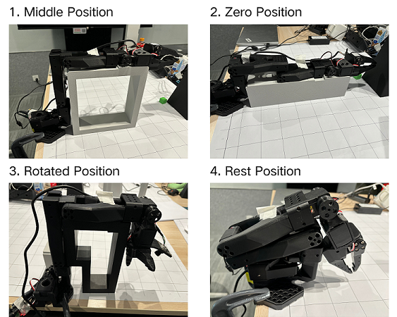
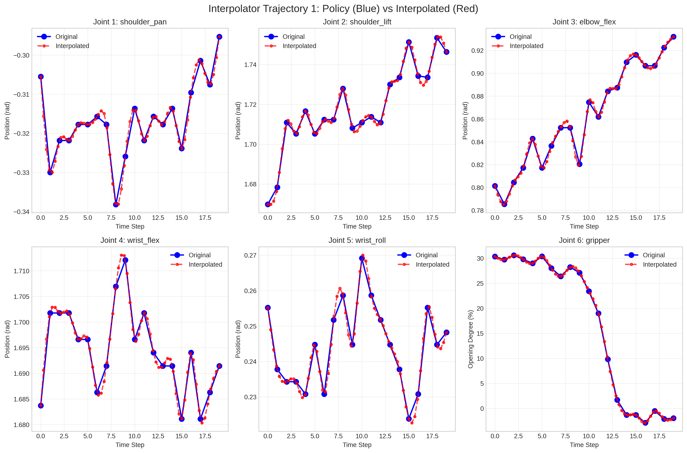

# LeRobot - RobotMotion Interface

## Section 1: Highlights

This package provides a comprehensive framework for controlling LeRobot arms with the following key features:

### Cross-Platform Support
- **Linux & macOS Compatible**: Works seamlessly on both operating systems
- **Unified Interface**: Same API for simulation, real hardware, and mock testing

### Robot Control Modes
- **MuJoCo Simulation**: Physics-based simulation environment for safe testing
- **Real Robot Interface**: Direct control of physical LeRobot SO100 arms via Feetech motors
- **Mock Robot Interface**: Hardware-free testing with identical API to real robot

### Advanced Features
- **Policy Interpolator**: Multiple methods to generate high-frequency control commands from low-frequency VLA outputs
- **Offline Joint Plotter**: Real-time visualization of commanded vs actual joint positions
- **Lightweight Python Environment**: Minimal dependencies for fast setup
- **Predefined Motion Patterns**: Built-in test movements for robot validation
- **VLA Integration**: Step-by-step progression from basic control to Vision-Language-Action models

### Development Workflow
- Start with simulation (no hardware needed)
- Test with mock interface (same API as real robot)
- Validate on real hardware
- Integrate with VLA systems

## Section 2: Installation and Setup

### 2.1 Auto-Complete Setup

```bash
# Navigate to project directory
cd robots/lerobot

# Run the complete setup (handles everything)
source ./setup_motion.sh
```

The setup script will:
- Create virtual environment if needed
- Install all dependencies from requirements.txt
- Set up the package in development mode (enables clean imports)
- Install LCM and other required packages
- Optionally install development tools

**Manual Setup (if preferred):**
```bash
# Create and activate virtual environment
python -m venv venv
source venv/bin/activate

# Then run setup
./setup_motion.sh
```

### 2.2 Find Motor Bus Port

```bash
cd robots/lerobot
python -m scripts.find_write_port
```
- Follow instructions to disconnect and reconnect USB cable
- The script will automatically detect and write the port to `configs/config.yaml`
- Detected port is typically `/dev/ttyACM0` on Linux, `/dev/tty.usbmodem*` on macOS


### 2.3 Calibrate Robot (Manual Mode Recommended)

```bash
cd robots/lerobot

# Manual calibration (recommended)
python -m scripts.follower_calibrate --mode manual
# follow the instructions in the terminal
# move the arm to the four desired configurations and press enter
```
**Note: when executing the script, the arm should be in either 1, 2,or 3 configuration, keep far away from the Rest position**



## Section 3: Follower Arm Joint Testing

### 3.1 Show Encoder Values (Safe Test)

```bash
cd robots/lerobot
python -m scripts.follower_show_encoder
```
- **🟢 Safe**: No motor movement, torque remains disabled
- Continuously displays joint positions in real-time
- Perfect for testing connections and monitoring

### 3.2 Joint Sine Wave Motion Test

```bash
cd robots/lerobot

# Test individual joints
python -m scripts.follower_jointsine --joint 1~6  # shoulder_pan, shoulder_lift, elbow_flex, wrist_flex, wrist_roll，gripper
```

```bash
cd robots/lerobot

# control lerobot by control window in mujoco interface, you can drag each joint control value by mouse
python -m scripts.lerobot_UI
```

- **🔴 Warning**: Enables torque and moves the arm
- Applies sine wave motion to specified joint
- Parameters: Amplitude 300 steps, Frequency 0.2 Hz (5 second period),for gripper amplitude is 750
- Use to verify each joint operates correctly

## Section 4: Unified Controller

### 4.1 Running the Unified Controller

```bash
cd robots/lerobot

# Test simulation (safe, no hardware needed)
python -m scripts.unified_controller --mode sim
# on MacOS, use mjpython instead of python to launch MuJoCo passive viewer
mjpython -m scripts.unified_controller --mode sim

# Test real robot (requires connected SO100 arm)
python -m scripts.unified_controller --mode real

# Test mock robot (no hardware needed, same interface as real)
python -m scripts.unified_controller --mode mock
```

### 4.2 Command Line Arguments

```bash
python -m scripts.unified_controller [OPTIONS]

Options:
  --mode {sim,real,mock}                 Control mode (required)
  --motion {0,1,2,3,4，5,6}                   Motion pattern (default: 0)
  --frequency {30-250}                    Control frequency in Hz (default: 100)

Examples:
  --mode sim                             # MuJoCo simulation
  --mode real --motion 2                 # Real robot with pattern 2
  --mode mock --frequency 150            # Mock robot at 150Hz
```

### 4.3 Control Modes

**Simulation Mode (`--mode sim`)**
- Uses MuJoCo physics simulation
- Visual environment with real-time rendering
- Safe for algorithm development
- Loads model from `models/lerobot/so101/scene/scene.xml`

**Real Robot Mode (`--mode real`)**
- Controls physical Feetech motors
- Requires calibrated robot connection
- Enables motor torque for movement
- Real-time hardware interaction

**Mock Robot Mode (`--mode mock`)**
- Hardware-free testing environment
- Identical API to real robot mode
- Perfect for development without hardware
- Same control logic as real robot

### 4.4 Motion Patterns

- **Motion 0**: LCM command mode (for VLA integration)
- **Motion 1**: Cyclic dance movements
- **Motion 2**: Circular motion pattern
- **Motion 3**: Complex fetching motion
- **Motion 4**: Linear trajectory to pose
- **Motion 5**: Go to specific position
- **Motion 6**: Random position cubes grabbing

### 4.5 Stopping the Controller

**Simulation Mode:**
- Press **Ctrl+C** in terminal, OR
- Close the MuJoCo viewer window

**Real/Mock Modes:**
- Press **Ctrl+C** in terminal

Both methods trigger automatic cleanup and safety shutdown.

## Policy Interpolator

The unified controller includes advanced trajectory interpolation capabilities to convert low-frequency VLA commands into high-frequency robot control commands, ensuring smooth and precise motion:



## Section 5: Logging and Plotting

### 5.1 Offline Joint Plotter

The unified controller includes an optional offline joint position plotter configured in `configs/config.yaml`:

```yaml
plot:
  enable_joint_plotting: true           # Enable offline joint plotting
  enable_interpolator_plotting: true    # Enable interpolator plotting
```

**Features:**
- **Command vs Feedback**: Shows commanded positions vs actual robot feedback
- **Real-time Visualization**: Updates during robot operation
- **Automatic Saving**: Saves plots to `~/RynnRcplog/lerobot/plots/` after execution
- **Cross-platform**: Works on both Linux and macOS

### 5.2 Logging System

**Log Files Location:**
The log directory is configured in `configs/config.yaml`:
```yaml
logging:
  log_dir: ~/RynnRcplog/robot_motion
  log_file: robot_motion.log
```

**Actual Log File Path:**
```bash
~/RynnRcplog/robot_motion/robot_motion_YYYYMMDD_HHMM.log
```

**Log Levels:**
- INFO: General operation status
- WARNING: Non-critical issues
- ERROR: Critical problems
- DEBUG: Detailed debugging information

**Plot Files Location:**
Based on the `log_dir` in config.yaml:
```bash
~/RynnRcplog/robot_motion/joint_plots/joint_positions_{mode}_YYYYMMDD_HHMMSS.png
~/RynnRcplog/robot_motion/interpolate_plots/interpolator_positions_{mode}_YYYYMMDD_HHMMSS.png
```

**Note:** The actual paths depend on your `config.yaml` configuration. The default shown above assumes `log_dir: ~/RynnRcplog/robot_motion` in your config file.

### 5.3 Policy Interpolator

The unified controller includes advanced trajectory interpolation capabilities to convert low-frequency VLA commands (typically 30Hz) into high-frequency robot control commands (up to 250Hz):

**Interpolation Methods:**
- **Cubic Spline with Boundary Conditions**: Smooth trajectory generation with controlled start/end velocities
- **B-Spline Interpolation**: Flexible curve fitting with adjustable control points
- **Interpolated Univariate Spline**: High-order polynomial interpolation for smooth motion

**Features:**
- **Frequency Upsampling**: Converts 30Hz VLA outputs to 100-250Hz control commands
- **Smooth Trajectories**: Eliminates jerk and ensures continuous motion
- **Real-time Processing**: Low-latency interpolation suitable for real-time control
- **Multiple Joint Support**: Simultaneous interpolation for all 6 joints plus gripper


This enables smooth, high-quality robot motion even when using low-frequency VLA policies.

## Section 6: Project Structure and Step-by-Step Workflow

### 6.1 Project Structure

```
robots/lerobot/
├── scripts/
│   ├── unified_controller.py      # Main unified controller
│   ├── follower_calibrate.py       # Robot calibration
│   ├── follower_show_encoder.py    # Safe encoder reading
│   ├── follower_jointsine.py       # Joint motion testing
│   └── find_write_port.py     # USB port detection
├── interface/
│   ├── unified_interface.py        # Unified robot interface
│   ├── robot_interface.py          # Real robot interface
│   └── mujoco_interface.py         # Simulation interface
├── utils/
│   ├── joint_plotter.py           # Offline plotting utilities
│   ├── lcm_handler.py              # LCM communication
│   └── policy_interpolator.py      # Trajectory interpolation
├── configs/
│   └── config.yaml                 # Robot configuration
├── requirements.txt                # Core dependencies
└── README.md                       # This file
```

### 6.2 Step-by-Step Workflow

#### Phase 1: Environment Setup
```bash
# 1. Complete setup (one command)
cd robots/lerobot
./setup_motion.sh

# 2. Find USB port (if using real robot)
python -m scripts.find_write_port
# Port is automatically written to config.yaml

# 3. Update config.yaml with plotting preferences if needed
```

#### Phase 2: Algorithm Development (No Hardware)
```bash
# 4. Test in simulation
python -m scripts.unified_controller --mode sim

# 5. Test with mock interface
python -m scripts.unified_controller --mode mock

# 6. Test different motion patterns
python -m scripts.unified_controller --mode sim --motion 2
```

#### Phase 3: Hardware Validation
```bash
# 7. Test hardware connection (safe)
python -m scripts.follower_show_encoder

# 8. Calibrate robot
python -m scripts.follower_calibrate --mode manual

# 9. Test individual joints
python -m scripts.follower_jointsine --joint 1

# 10. Run unified controller on real robot
python -m scripts.unified_controller --mode real
```

#### Phase 4: Advanced Features
```bash
# 11. Enable plotting in config.yaml for analysis
# Edit configs/config.yaml: set enable_joint_plotting: true

# 12. Test VLA integration (default mode)
python -m scripts.unified_controller --mode real

# 13. Adjust control frequency for performance
python -m scripts.unified_controller --mode real --frequency 200

# 14. Load different scenes, --scene=1 or 2 or 3, (see scene_path in config.yaml)
python -m scripts.unified_controller --mode sim --scene 2
```

### 6.3 Development Progression

1. **Start Safe**: Always begin with simulation or mock mode
2. **Validate Hardware**: Use read-only scripts before enabling motion
3. **Test Incrementally**: Test one joint at a time before full system
4. **Monitor Performance**: Use plotting to verify control quality
5. **Scale Gradually**: Increase complexity as confidence builds

This workflow ensures safe, systematic development from basic control to advanced VLA integration.
