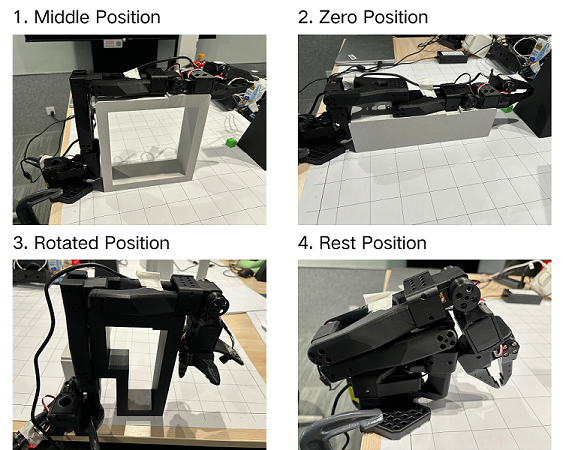
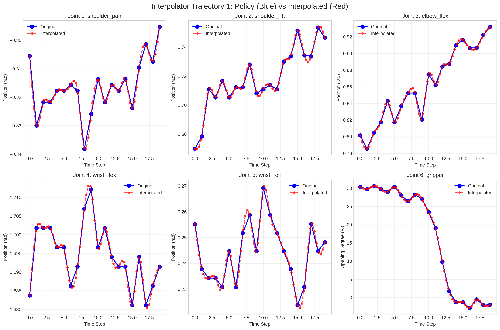

# LeRobot - 机器人运动接口

## 第一部分：亮点特性

本软件包为控制 LeRobot 机械臂提供了全面的框架，具有以下关键特性：

### 跨平台支持
- **Linux 和 macOS 兼容**：在两个操作系统上无缝运行
- **统一接口**：仿真、真实硬件和模拟测试使用相同的 API

### 机器人控制模式
- **MuJoCo 仿真**：基于物理的仿真环境，用于安全测试
- **真实机器人接口**：通过 Feetech 电机直接控制物理 LeRobot SO100 机械臂
- **模拟机器人接口**：无需硬件的测试环境，与真实机器人 API 完全相同

### 高级功能
- **VLA高频指令生成器**：多种方法将低频 VLA 输出生成高频控制命令
- **离线关节绘图器**：命令位置与实际位置的实时可视化对比
- **轻量级 Python 环境**：最小依赖，快速设置
- **预定义运动模式**：内置测试动作用于机器人验证
- **VLA 集成**：从基础控制到视觉-语言-动作模型的逐步进展

### 开发工作流程
- 从仿真开始（无需硬件）
- 使用模拟接口测试（与真实机器人相同的 API）
- 在真实硬件上验证
- 与 VLA 系统集成

## 第二部分：安装和设置

### 2.1 自动环境设置

```bash
# 导航到项目目录
cd robots/lerobot

# 自动安装依赖和环境
source ./setup_motion.sh
```

设置脚本将：
- 根据需要创建虚拟环境
- 从 requirements.txt 安装所有依赖项
- 以开发模式设置包（启用清洁导入）
- 安装 LCM 和其他必需包
- 可选安装开发工具

**手动设置（如果需要）：**
```bash
# 创建并激活虚拟环境
python -m venv venv
source venv/bin/activate

# 然后运行设置
./setup_motion.sh
```

### 2.2 查找电机串口端口

```bash
cd robots/lerobot
python -m scripts.find_write_port
```
- 按照说明断开并重新连接 USB 电缆
- 脚本将自动检测端口并写入 `configs/config.yaml` 配置文件
- 检测到的端口通常是 Linux 上的 `/dev/ttyACM0`，macOS 上的 `/dev/tty.usbmodem*`

### 2.3 校准机器人（推荐手动模式）

```bash
cd robots/lerobot

# 手动校准（推荐）
python -m scripts.follower_calibrate --mode manual
# 根据命令行提示信息，依次将机械臂摆放至下图中四个姿态，并按回车
```
**注意：当执行校准脚本时刻，机械臂应处于下图中1，2 或 3 姿态，远离Rest Position**



## 第三部分：从动臂关节测试

### 3.1 显示编码器值（安全测试）

```bash
cd robots/lerobot
python -m scripts.follower_show_encoder
```
- **🟢 安全**：无电机运动，扭矩保持禁用状态
- 实时连续显示关节位置
- 非常适合测试连接和监控

### 3.2 关节正弦波运动测试

```bash
cd robots/lerobot

# 测试单个关节
python -m scripts.follower_jointsine --joint 1~6  # shoulder_pan, shoulder_lift, elbow_flex, wrist_flex, wrist_roll, gripper
```

```bash
cd robots/lerobot

# 在mujoco界面中通过控制窗口控制lerobot，可以用鼠标拖动每个关节控制值
python -m scripts.lerobot_UI
```

- **🔴 警告**：启用扭矩并移动机械臂
- 对指定关节应用正弦波运动
- 参数：幅度 300 步，频率 0.2 Hz（5 秒周期）,对于夹爪，幅度为750步
- 用于验证每个关节是否正常工作

## 第四部分：统一控制器

### 4.1 运行统一控制器

```bash
cd robots/lerobot

# 测试仿真（安全，无需硬件）
python -m scripts.unified_controller --mode sim
# 在 MacOS 上，使用 mjpython 而不是 python 来启动 MuJoCo 被动查看器
mjpython -m scripts.unified_controller --mode sim

# 测试真实机器人（需要连接 SO100 机械臂）
python -m scripts.unified_controller --mode real

# 测试模拟机器人（无需硬件，与真实机器人接口相同）
python -m scripts.unified_controller --mode mock
```

### 4.2 命令行参数

```bash
python -m scripts.unified_controller [选项]

选项:
  --mode {sim,real,mock}                  控制模式（必需）
  --motion {0,1,2,3,4,5,6}                运动模式（默认：0）
  --frequency {30-250}                    控制频率，单位 Hz（默认：100）

示例:
  --mode sim                             # MuJoCo 仿真
  --mode real --motion 2                 # 真实机器人，模式 2
  --mode mock --frequency 150            # 模拟机器人，150Hz
```

### 4.3 控制模式

**仿真模式（`--mode sim`）**
- 使用 MuJoCo 物理仿真
- 实时渲染的可视化环境
- 算法开发安全
- 从 `models/lerobot/so101/scene/scene.xml` 加载模型

**真实机器人模式（`--mode real`）**
- 控制物理 Feetech 电机
- 需要校准的机器人连接
- 启用电机扭矩进行运动
- 实时硬件交互

**模拟机器人模式（`--mode mock`）**
- 无硬件测试环境
- 与真实机器人模式相同的 API
- 无硬件开发的完美选择
- 与真实机器人相同的控制逻辑

### 4.4 运动模式

- **运动 0**：LCM 命令模式（用于 VLA 集成）
- **运动 1**：周期性舞蹈动作
- **运动 2**：圆形运动模式
- **运动 3**：复杂抓取运动
- **运动 4**：线性轨迹到姿态
- **运动 5**：移动到特定位置
- **运动 6**：抓取随机位置物块（目前仅可用于仿真模式）

### 4.5 停止控制器

**仿真模式：**
- 在终端按 **Ctrl+C**，或
- 关闭 MuJoCo 查看器窗口

**真实/模拟模式：**
- 在终端按 **Ctrl+C**

两种方法都会触发自动清理和安全关闭。

## 策略插值器

统一控制器包含先进的轨迹插值功能，可将低频 VLA 命令转换为高频机器人控制命令，确保平滑精确的运动：



## 第五部分：日志和绘图

### 5.1 离线关节绘图器

统一控制器包含可选的离线关节位置绘图器，在 `configs/config.yaml` 中配置：

```yaml
plot:
  enable_joint_plotting: true           # 启用离线关节绘图
  enable_interpolator_plotting: true    # 启用插值器绘图
```

**功能：**
- **命令与反馈对比**：显示命令位置与实际机器人反馈
- **实时可视化**：在机器人运行期间更新
- **自动保存**：执行后将图表保存到 `~/logs/lerobot/plots/`
- **跨平台**：在 Linux 和 macOS 上都能工作

### 5.2 日志系统

**日志文件位置：**
日志目录在 `configs/config.yaml` 中配置：
```yaml
logging:
  log_dir: ~/RynnRcplog/robot_motion
  log_file: robot_motion.log
```

**日志文件路径：**
```bash
~/RynnRcplog/robot_motion/robot_motion_YYYYMMDD_HHMM.log
```

**日志级别：**
- INFO：一般操作状态
- WARNING：非关键问题
- ERROR：关键问题
- DEBUG：详细调试信息

**绘图文件位置：**
基于 config.yaml 中的 `log_dir`：
```bash
~/RynnRcplog/robot_motion/joint_plots/joint_positions_{mode}_YYYYMMDD_HHMMSS.png
~/RynnRcplog/robot_motion/interpolate_plots/interpolator_positions_{mode}_YYYYMMDD_HHMMSS.png
```

### 5.3 高频样条拟合插值算法

统一控制器包含高级轨迹插值功能，可将低频 VLA 命令（通常 30Hz）转换为高频机器人控制命令（高达 250Hz）：

**插值方法：**
- **三次样条**：具有受控起始/结束速度的平滑轨迹生成
- **B 样条插值**：具有可调控制点的灵活曲线拟合
- **插值单变量样条**：用于平滑运动的高阶多项式插值

**功能：**
- **VLA高频指令生成器**：将 30Hz VLA 输出转换为 50～1kHz 控制命令
- **平滑轨迹**：消除抖动并确保连续运动
- **实时处理**：适合实时控制的低延迟插值
- **多关节支持**：同时对所有 6 个关节加夹爪进行插值

这使得即使在使用低频 VLA 策略时也能实现平滑、高质量的机器人运动。

## 第六部分：项目结构和逐步工作流程

### 6.1 项目结构

```
robots/lerobot/
├── scripts/
│   ├── unified_controller.py      # 主统一控制器
│   ├── follower_calibrate.py       # 机器人校准
│   ├── follower_show_encoder.py    # 安全编码器读取
│   ├── follower_jointsine.py       # 关节运动测试
│   └── find_write_port.py     # USB 端口检测
├── interface/
│   ├── unified_interface.py        # 统一机器人接口
│   ├── robot_interface.py          # 真实机器人接口
│   └── mujoco_interface.py         # 仿真接口
├── utils/
│   ├── joint_plotter.py           # 离线绘图工具
│   ├── lcm_handler.py              # LCM 通信
│   └── policy_interpolator.py      # 轨迹插值
├── configs/
│   └── config.yaml                 # 机器人配置
├── requirements.txt                # 核心依赖
└── README.md                       # 此文件
```

### 6.2 逐步工作流程

#### 阶段 1：环境设置
```bash
# 1. 完整设置（一键完成）
cd robots/lerobot
./setup_motion.sh

# 2. 查找 USB 端口（如果使用真实机器人）
python -m scripts.find_write_port
# 端口会自动写入 config.yaml

# 3. 如需要，更新 config.yaml 中的绘图首选项
```

#### 阶段 2：算法开发（无硬件）
```bash
# 4. 在仿真中测试
python -m scripts.unified_controller --mode sim

# 5. 使用模拟接口测试
python -m scripts.unified_controller --mode mock

# 6. 测试不同运动模式
python -m scripts.unified_controller --mode sim --motion 2
```

#### 阶段 3：硬件验证
```bash
# 7. 测试硬件连接（安全）
python -m scripts.follower_show_encoder

# 8. 校准机器人
python -m scripts.follower_calibrate --mode manual

# 9. 测试单个关节
python -m scripts.follower_jointsine --joint 1

# 10. 在真实机器人上运行统一控制器
python -m scripts.unified_controller --mode real
```

#### 阶段 4：高级功能
```bash
# 11. 在 config.yaml 中启用绘图进行分析
# 编辑 configs/config.yaml：设置 enable_joint_plotting: true

# 12. 测试 VLA 集成（默认模式）
python -m scripts.unified_controller --mode real

# 13. 调整控制频率以提高性能
python -m scripts.unified_controller --mode real --frequency 200

# 14. 加载不同的场景：--scene=1， 或者2，或者3，（查看config.yaml中的scene_path字典）
python -m scripts.unified_controller --mode sim --scene 2
```
